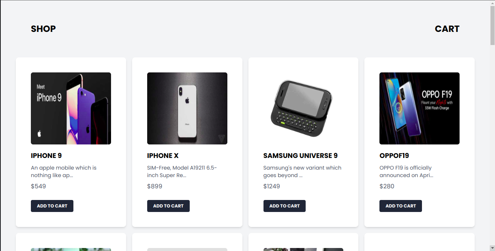

# Implementing Cart Functionality in React JS

## Introduction
In this tutorial, we will be implementing a cart functionality in React JS. We will be using React Hooks to manage the state of the cart. We will be using the Context API to pass the cart state to the components that need it. We will be using the Local Storage API to persist the cart state in the browser.We will also be using Tailwind CSS to style our application.

## Prerequisites
To follow along with this tutorial, you will need to have the following installed on your machine:
- Node.js
- npm

You also need to have a basic understanding of React JS and Tailwind CSS.

## Getting Started
To get started, we will create a new React application using vite. To do this, run the following command in your terminal:

```bash
npm create vite@latest
```

You will be prompted to enter the name of your project. Enter the name of your project and press enter. In this tutorial, we will be naming our project `react-cart`. You will also be prompted to select a framework. Select `React` and press enter. You will also be prompted to select a variant. Select `Javascript` and press enter. This will create a new React application in a folder named `react-cart`. To start the application, navigate to the `react-cart` folder `cd react-card` and run the following command in your terminal:

```bash
npm run dev
```

This will start the application in development mode. You can now open the application in your browser by navigating to `http://localhost:5173`.

## Installing Tailwind CSS
To install Tailwind CSS, run the following command in your terminal:

```bash
npm install -D tailwindcss postcss autoprefixer
```
```bash
npx tailwindcss init -p
```

This will create a `tailwind.config.js` file in the root of your project. Open the `tailwind.config.js` file and add the following code to it:

```js
/** @type {import('tailwindcss').Config} */
module.exports = {
  content: [
    "./src/**/*.{js,jsx,ts,tsx}",
  ],
  theme: {
    extend: {},
  },
  plugins: [],
}
```

Next, let's clean up the `index.css` file in the `src` folder. Open the `index.css` file and remove all the code in it. Next, add the following code to the `index.css` file:

```css
@tailwind base;
@tailwind components;
@tailwind utilities;
```

Let's also clear up the `App.jsx` file in the `src` folder so that it looks like this:

```jsx
function App() {
  return (
    <>
    </>
  )
}
```
You can also delete the `App.css` file in the `src` folder.

## Creating the Products Component
Let's create a new folder named `components` in the `src` folder. Inside the `components` folder, create a new file named `Products.jsx`.
We will be using the [Dummy Json](https://dummyjson.com/docs/products) to get the products that we will be displaying in our application. To fetch the products, we will be using the `useEffect` hook. We will also be using the `useState` hook to store the products in the state. Let's import the `useEffect` and `useState` hooks from the `react` package. Add the following code to the `Products.jsx` file:

```jsx
import { useEffect, useState } from "react";
```

Create a new function named `Products` and export it. Add the following code to the `Products.jsx` file:

```jsx
export default function Products() {
  return (
    <>
    </>
  )
}
```


Let's initialize the state of the products. Add the following code to the `Products.jsx` file:

```jsx
const [products, setProducts] = useState([]);
```

Next, let's fetch the products.We will use an `async` function to fetch the products. Add the following code to the `Products.jsx` file:


```jsx
async function getProducts() {
    const response = await fetch('https://dummyjson.com/products')  // fetch the products
    const data = await response.json() // convert the response to json
    setProducts(data.products) // set the products in the state to the products we fetched
  }
```

Next, let's call the `getProducts` function in the `useEffect` hook. Add the following code to the `Products.jsx` file:

```jsx
useEffect(() => {
    getProducts()
  }, [])
```

Next, let's display the products in the `Products` component. In the return statement of the `Products` component, add the following code:

```jsx
<div className='flex flex-col justify-center bg-gray-100'>
  <div className='flex justify-between items-center px-20 py-5'>
    <h1 className='text-2xl uppercase font-bold mt-10 text-center mb-10'>Shop</h1>
  </div>
  <div className='grid sm:grid-cols-2 md:grid-cols-3 lg:grid-cols-4 gap-4 px-10'>
    {
      products.map(product => (
        <div key={product.id} className='bg-white shadow-md rounded-lg px-10 py-10'>
          
          <div className='mt-4'>
            <h1 className='text-lg uppercase font-bold'>{product.title}</h1>
            <p className='mt-2 text-gray-600 text-sm'>{product.description.slice(0, 40)}...</p>
            <p className='mt-2 text-gray-600'>${product.price}</p>
          </div>
          <div className='mt-6 flex justify-between items-center'>
            <button className='px-4 py-2 bg-gray-800 text-white text-xs font-bold uppercase rounded hover:bg-gray-700 focus:outline-none focus:bg-gray-700'>Add to cart</button>
          </div>
        </div>
      ))
    }
  </div>
</div>
```
This will display a card for each product. Each card will display the product image, title, description, and price. Each card will also have a button that will be used to add the product to the cart.

Navigate to `App.jsx` and import the `Products` component. Add the following code to the `App.jsx` file:

```jsx
import Products from './components/Products'
```

Next, let's display the `Products` component in the `App` component. In the return statement of the `App` component, add the following code:

```jsx
<Products />
```

Your `App.jsx` file should now look like this:

```jsx
import Products from './components/Products'

function App() {
  return (
    <Products />
  )
}

export default App
```

Your `Products.jsx` file should now look like this:

```jsx
import { useState, useEffect } from 'react'


export default function Products() {
  const [products, setProducts] = useState([])

  async function getProducts() {
    const response = await fetch('https://dummyjson.com/products')
    const data = await response.json()
    setProducts(data.products)
  }

  useEffect(() => {
    getProducts()
  }, [])

  return (
    <div className='flex flex-col justify-center bg-gray-100'>
      <div className='flex justify-between items-center px-20 py-5'>
        <h1 className='text-2xl uppercase font-bold mt-10 text-center mb-10'>Shop</h1>
        <h1 className='text-2xl uppercase font-bold mt-10 text-center mb-10'>Cart</h1>
      </div>
      <div className='grid sm:grid-cols-2 md:grid-cols-3 lg:grid-cols-4 gap-4 px-10'>
        {
          products.map(product => (
            <div key={product.id} className='bg-white shadow-md rounded-lg px-10 py-10'>
              
              <div className='mt-4'>
                <h1 className='text-lg uppercase font-bold'>{product.title}</h1>
                <p className='mt-2 text-gray-600 text-sm'>{product.description.slice(0, 40)}...</p>
                <p className='mt-2 text-gray-600'>${product.price}</p>
              </div>
              <div className='mt-6 flex justify-between items-center'>
                <button className='px-4 py-2 bg-gray-800 text-white text-xs font-bold uppercase rounded hover:bg-gray-700 focus:outline-none focus:bg-gray-700'>Add to cart</button>
              </div>
            </div>
          ))
        }
      </div>
    </div>
  )
}
```

Open the application in your browser and you should see the products displayed.


## Creating the Cart Context
Context is a way to pass data through the component tree without having to pass props down manually at every level. In this tutorial, we will be using the Context API to pass the cart state to the components that need it. Let's create a new folder named `context` in the `src` folder. Inside the `context` folder, create a new file named `cart.jsx`. We will be using the `createContext` hook to create the cart context.We will also be using the `useState` hook to store the cart state and the `useEffect` hook to persist the cart state in the browser. Let's import the `createContext`, `useState`, and `useEffect` hooks from the `react` package. Add the following code to the `cart.jsx` file:

```jsx
import { createContext, useState, useEffect } from 'react'
```

Next, let's create the cart context. Add the following code to the `cart.jsx` file:

```jsx
export const CartContext = createContext()
```

Next, let's create the `CartProvider` component. Add the following code to the `cart.jsx` file:

```jsx
export const CartProvider = ({ children }) => {
}
```

Initialize the state of the cart. Add the following code to the `cart.jsx` file:

```jsx
const [cartItems, setCartItems] = useState([])
```

Looking at how we want our cart to work, we want to be able to add items to the cart, remove items from the cart, and clear the cart. Let's create a function that will be used to add items to the cart. Add the following code to the `cart.jsx` file:

```jsx
 const addToCart = (item) => {
  const isItemInCart = cartItems.find((cartItem) => cartItem.id === item.id); // check if the item is already in the cart

  if (isItemInCart) {
  setCartItems(
      cartItems.map((cartItem) => // if the item is already in the cart, increase the quantity of the item
      cartItem.id === item.id
          ? { ...cartItem, quantity: cartItem.quantity + 1 }
          : cartItem // otherwise, return the cart item
      )
  );
  } else {
  setCartItems([...cartItems, { ...item, quantity: 1 }]); // if the item is not in the cart, add the item to the cart
  }
};
```
Explanation:
- We are using the `find` method to check if the item is already in the cart. The `find` method returns the value of the first element in the array that satisfies the provided testing function. If no values satisfy the testing function, `undefined` is returned.
- If the item is already in the cart, we are using the `map` method to increase the quantity of the item in the cart. The `map` method creates a new array populated with the results of calling a provided function on every element in the calling array.
- If the item is not in the cart, we are using the spread operator to add the item to the cart.

Let's create a function that will be used to remove items from the cart. Add the following code to the `cart.jsx` file:

```jsx
 const removeFromCart = (item) => {
  const isItemInCart = cartItems.find((cartItem) => cartItem.id === item.id);

  if (isItemInCart.quantity === 1) {
    setCartItems(cartItems.filter((cartItem) => cartItem.id !== item.id)); // if the quantity of the item is 1, remove the item from the cart
  } else {
    setCartItems(
      cartItems.map((cartItem) =>
        cartItem.id === item.id
          ? { ...cartItem, quantity: cartItem.quantity - 1 } // if the quantity of the item is greater than 1, decrease the quantity of the item
          : cartItem
      )
    );
  }
};
```
Explanation:
- We are using the `find` method to check if the item is in the cart. The `find` method returns the value of the first element in the array that satisfies the provided testing function. If no values satisfy the testing function, `undefined` is returned.
- If the quantity of the item is 1, we are using the `filter` method to remove the item from the cart. The `filter` method creates a new array with all elements that pass the test implemented by the provided function.
- If the quantity of the item is greater than 1, we are using the `map` method to decrease the quantity of the item in the cart. The `map` method creates a new array populated with the results of calling a provided function on every element in the calling array.

Let's create a function that will be used to clear the cart. Add the following code to the `cart.jsx` file:

```jsx
const clearCart = () => {
  setCartItems([]); // set the cart items to an empty array
};
```
Explanation:
- We are using the `setCartItems` method to set the cart items to an empty array.

Let's create a function to get the cart total. Add the following code to the `cart.jsx` file:

```jsx
const getCartTotal = () => {
  return cartItems.reduce((total, item) => total + item.price * item.quantity, 0); // calculate the total price of the items in the cart
};
```
Explanation of the code above:
- We are using the `reduce` method to calculate the total price of the items in the cart. The `reduce` method executes a reducer function (that you provide) on each element of the array, resulting in a single output value.

Next, let's use the `useEffect` hook to persist the cart state in the browser. Add the following code to the `cart.jsx` file:

```jsx
useEffect(() => {
  localStorage.setItem("cartItems", JSON.stringify(cartItems));
}, [cartItems]);
```
Explanation:
- We are using the `setItem` method of the `localStorage` API to set the cart items in the browser. The `setItem` method sets the value of the specified `localStorage` item.
- We are using the `JSON.stringify` method to convert the cart items to a string. The `JSON.stringify` method converts a JavaScript object or value to a JSON string.
- For a real-world application, you will need to use a database to store the cart items, since the `localStorage` API is not secure and can be easily manipulated by the user.

Let's also use the `useEffect` hook to get the cart items from the browser. Add the following code to the `cart.jsx` file:

```jsx
useEffect(() => {
    const cartItems = localStorage.getItem("cartItems");
    if (cartItems) {
    setCartItems(JSON.parse(cartItems));
    }
}, []);
```
Explanation:
- We are using the `getItem` method of the `localStorage` API to get the cart items from the browser. The `getItem` method returns the value of the specified `localStorage` item.
- We are using the `JSON.parse` method to convert the cart items to an object. The `JSON.parse` method parses a JSON string, constructing the JavaScript value or object described by the string.

Let's update the initial state of cart items to the cart items we get from the browser. Add the following code to the `cart.jsx` file:

```jsx
const [cartItems, setCartItems] = useState(localStorage.getItem('cartItems') ? JSON.parse(localStorage.getItem('cartItems')) : [])
```
This will set the initial state of the cart items to the cart items we get from the browser. If there are no cart items in the browser, the initial state of the cart items will be an empty array.

Next, let's pass the cart state to the components that need it. Add the following code to the `cart.jsx` file:

```jsx
return (
  <CartContext.Provider
    value={{
      cartItems,
      addToCart,
      removeFromCart,
      clearCart,
      getCartTotal,
    }}
  >
    {children}
  </CartContext.Provider>
);
```

Your `cart.jsx` file should now look like this:

```jsx
import { createContext, useState, useEffect } from 'react'

export const CartContext = createContext()

export const CartProvider = ({ children }) => {
  const [cartItems, setCartItems] = useState(localStorage.getItem('cartItems') ? JSON.parse(localStorage.getItem('cartItems')) : [])

  const addToCart = (item) => {
    const isItemInCart = cartItems.find((cartItem) => cartItem.id === item.id);

    if (isItemInCart) {
      setCartItems(
        cartItems.map((cartItem) =>
          cartItem.id === item.id
            ? { ...cartItem, quantity: cartItem.quantity + 1 }
            : cartItem
        )
      );
    } else {
      setCartItems([...cartItems, { ...item, quantity: 1 }]);
    }
  };

  const removeFromCart = (item) => {
    const isItemInCart = cartItems.find((cartItem) => cartItem.id === item.id);

    if (isItemInCart.quantity === 1) {
      setCartItems(cartItems.filter((cartItem) => cartItem.id !== item.id));
    } else {
      setCartItems(
        cartItems.map((cartItem) =>
          cartItem.id === item.id
            ? { ...cartItem, quantity: cartItem.quantity - 1 }
            : cartItem
        )
      );
    }
  };

  const clearCart = () => {
    setCartItems([]);
  };

  const getCartTotal = () => {
    return cartItems.reduce((total, item) => total + item.price * item.quantity, 0);
  };

  useEffect(() => {
    localStorage.setItem("cartItems", JSON.stringify(cartItems));
  }, [cartItems]);

  useEffect(() => {
    const cartItems = localStorage.getItem("cartItems");
    if (cartItems) {
      setCartItems(JSON.parse(cartItems));
    }
  }, []);

  return (
    <CartContext.Provider
      value={{
        cartItems,
        addToCart,
        removeFromCart,
        clearCart,
        getCartTotal,
      }}
    >
      {children}
    </CartContext.Provider>
  );
};
```

## Using the Cart Context
Now that we have created the cart context, let's wrap the `App` component with the `CartProvider` component. Open the `main.jsx` file in the `src` folder and import the `CartProvider` component. Add the following code to the `main.jsx` file:

```jsx
import { CartProvider } from './context/cart'
```
Next, let's wrap the `App` component with the `CartProvider` component. Add the following code to the `main.jsx` file:

```jsx
<CartProvider>
  <App />
</CartProvider>
```

Your `main.jsx` file should now look like this:

```jsx
import React from 'react'
import ReactDOM from 'react-dom/client'
import App from './App.jsx'
import './index.css'
import { CartProvider } from './context/cart.jsx'

ReactDOM.createRoot(document.getElementById('root')).render(
  <React.StrictMode>
    <CartProvider>
      <App />
    </CartProvider>
  </React.StrictMode>,
)
```

Next, let's import the `CartContext` from the `cart` file in the `context` folder. Add the following code to the `Products.jsx` file:

```jsx
import { CartContext } from '../context/cart'
```

We will also need to import the `useContext` hook from the `react` package. Update the import statement in the `Products.jsx` file to look like this:

```jsx
import { useContext, useEffect, useState } from 'react'
```

Next, let's use the `useContext` hook to get the cart state. Add the following code to the `Products.jsx` file:

```jsx
const { cartItems, addToCart } = useContext(CartContext)
```

Next, let's update the `addToCart` button to use the `addToCart` function from the cart context. Update the `addToCart` button to look like this:

```jsx
<button onClick={() => addToCart(product)} className='px-4 py-2 bg-gray-800 text-white text-xs font-bold uppercase rounded hover:bg-gray-700 focus:outline-none focus:bg-gray-700'>Add to cart</button>
```

Now the button should add the product to the cart when clicked, but it's hard to visualize this without a cart page.
Let's start by creating a `Cart` component. Create a new file named `Cart.jsx` in the `components` folder. We will be using the `useContext` hook to get the cart state. Let's import the `useContext` hook from the `react` package. Add the following code to the `Cart.jsx` file:

```jsx
import { useContext } from 'react'
```

Next, let's import the `CartContext` from the `cart` file in the `context` folder. Add the following code to the `Cart.jsx` file:

```jsx
import { CartContext } from '../context/cart'
```

Create a new function named `Cart` and export it. Add the following code to the `Cart.jsx` file:

```jsx
export default function Cart() {
  return (
    <>
    </>
  )
}
```

Let's use the `useContext` hook to get the cart state. Add the following code to the `Cart.jsx` file:

```jsx
const { cartItems, addToCart, removeFromCart, clearCart, getCartTotal } = useContext(CartContext)
```

Next, let's display the cart items in the `Cart` component. In the return statement of the `Cart` component, add the following code:

```jsx
<div className="flex-col flex items-center bg-white gap-8 p-10 text-black text-sm">
  <h1 className="text-2xl font-bold">Cart</h1>
  <div className="flex flex-col gap-4">
    {cartItems.map((item) => (
      <div className="flex justify-between items-center" key={item.id}>
        <div className="flex gap-4">
          
          <div className="flex flex-col">
            <h1 className="text-lg font-bold">{item.title}</h1>
            <p className="text-gray-600">{item.price}</p>
          </div>
        </div>
        <div className="flex gap-4">
          <button
            className="px-4 py-2 bg-gray-800 text-white text-xs font-bold uppercase rounded hover:bg-gray-700 focus:outline-none focus:bg-gray-700"
            onClick={() => {
              addToCart(item)
            }}
          >
            +
          </button>
          <p>{item.quantity}</p>
          <button
            className="px-4 py-2 bg-gray-800 text-white text-xs font-bold uppercase rounded hover:bg-gray-700 focus:outline-none focus:bg-gray-700"
            onClick={() => {
              removeFromCart(item)
            }}
          >
            -
          </button>
        </div>
      </div>
    ))}
  </div>
  {
    cartItems.length > 0 ? (
      <div className="flex flex-col justify-between items-center">
    <h1 className="text-lg font-bold">Total: ${getCartTotal()}</h1>
    <button
      className="px-4 py-2 bg-gray-800 text-white text-xs font-bold uppercase rounded hover:bg-gray-700 focus:outline-none focus:bg-gray-700"
      onClick={() => {
        clearCart()
      }}
    >
      Clear cart
    </button>
  </div>
    ) : (
      <h1 className="text-lg font-bold">Your cart is empty</h1>
    )
  }
</div>
```

This will display the cart items in the cart component. Each cart item will display the item image, title, price, and quantity. Each cart item will also have a button to increase the quantity of the item and a button to decrease the quantity of the item. The cart component will also display the total price of the items in the cart and a button to clear the cart.

You can now choose the best way to navigate to your cart from the products page using the react router. In this tutorial, we will be toggling a modal to display the cart.
In the `Products` component, let's import the `Cart` component. Add the following code to the `Products.jsx` file:

```jsx
import Cart from './Cart'
```

Let's also initialize the state of the modal. Add the following code to the `Products.jsx` file:

```jsx
const [showModal, setShowModal] = useState(false)
```

Let's create a function to toggle the modal. Add the following code to the `Products.jsx` file:

```jsx
const toggle = () => {
  setShowModal(!showModal)
}
```

Next, we will add a button to toggle the modal. Add the following code to the `Products.jsx` file below the `h1` tag:

```jsx
{!showModal && <button className='px-4 py-2 bg-gray-800 text-white text-xs font-bold uppercase rounded hover:bg-gray-700 focus:outline-none focus:bg-gray-700'
  onClick={toggle}
>Cart ({cartItems.length})</button>}
```
This will display a button to toggle the modal. The button will display the number of items in the cart.

Let's now display the modal( `Cart` component) when the button is clicked. Add the following code to the `Products.jsx` file just before the last closing `div` tag:

```jsx
  <Cart showModal={showModal} toggle={toggle} />
```

Your `Products.jsx` file should now look like this:

```jsx
import { useState, useEffect, useContext } from 'react'
import { CartContext } from '../context/cart.jsx'
import Cart from './Cart.jsx'


export default function Products() {
  const [showModal, setshowModal] = useState(false);
  const [products, setProducts] = useState([])
  const { cartItems, addToCart } = useContext(CartContext)

  const toggle = () => {
    setshowModal(!showModal);
  };

  async function getProducts() {
    const response = await fetch('https://dummyjson.com/products')
    const data = await response.json()
    setProducts(data.products)
  }

  useEffect(() => {
    getProducts()
  }, [])

  return (
    <div className='flex flex-col justify-center bg-gray-100'>
      <div className='flex justify-between items-center px-20 py-5'>
        <h1 className='text-2xl uppercase font-bold mt-10 text-center mb-10'>Shop</h1>
        {!showModal && <button className='px-4 py-2 bg-gray-800 text-white text-xs font-bold uppercase rounded hover:bg-gray-700 focus:outline-none focus:bg-gray-700'
          onClick={toggle}
        >Cart ({cartItems.length})</button>}
      </div>
      <div className='grid sm:grid-cols-2 md:grid-cols-3 lg:grid-cols-4 gap-4 px-10'>
        {
          products.map(product => (
            <div key={product.id} className='bg-white shadow-md rounded-lg px-10 py-10'>
              
              <div className='mt-4'>
                <h1 className='text-lg uppercase font-bold'>{product.title}</h1>
                <p className='mt-2 text-gray-600 text-sm'>{product.description.slice(0, 40)}...</p>
                <p className='mt-2 text-gray-600'>${product.price}</p>
              </div>
              <div className='mt-6 flex justify-between items-center'>
                <button className='px-4 py-2 bg-gray-800 text-white text-xs font-bold uppercase rounded hover:bg-gray-700 focus:outline-none focus:bg-gray-700'
                  onClick={() => {
                    addToCart(product)
                  }
                  }
                >Add to cart</button>
              </div>
            </div>
          ))
        }
      </div>
      <Cart showModal={showModal} toggle={toggle} />
    </div>
  )
}
```

Let's update the `Cart` component to use the `showModal` prop. Open the `Cart.jsx` file and update the `Cart` component to look like this:

```jsx
import PropTypes from 'prop-types'
import { useContext } from 'react'
import { CartContext } from '../context/cart.jsx'

export default function Cart ({showModal, toggle}) {

  const { cartItems, addToCart, removeFromCart, clearCart, getCartTotal } = useContext(CartContext)


  return (
    showModal && (
      <div className="flex-col flex items-center fixed inset-0 left-1/4 bg-white dark:bg-black gap-8  p-10  text-black dark:text-white font-normal uppercase text-sm">
        <h1 className="text-2xl font-bold">Cart</h1>
        <div className="absolute right-16 top-10">
          <button
            className="px-4 py-2 bg-gray-800 text-white text-xs font-bold uppercase rounded hover:bg-gray-700 focus:outline-none focus:bg-gray-700"
            onClick={toggle}
          >
            Close
          </button>
        </div>
        <div className="flex flex-col gap-4">
          {cartItems.map((item) => (
            <div className="flex justify-between items-center" key={item.id}>
              <div className="flex gap-4">
                
                <div className="flex flex-col">
                  <h1 className="text-lg font-bold">{item.title}</h1>
                  <p className="text-gray-600">{item.price}</p>
                </div>
              </div>
              <div className="flex gap-4">
                <button
                  className="px-4 py-2 bg-gray-800 text-white text-xs font-bold uppercase rounded hover:bg-gray-700 focus:outline-none focus:bg-gray-700"
                  onClick={() => {
                    addToCart(item)
                  }}
                >
                  +
                </button>
                <p>{item.quantity}</p>
                <button
                  className="px-4 py-2 bg-gray-800 text-white text-xs font-bold uppercase rounded hover:bg-gray-700 focus:outline-none focus:bg-gray-700"
                  onClick={() => {
                    removeFromCart(item)
                  }}
                >
                  -
                </button>
              </div>
            </div>
          ))}
        </div>
        {
          cartItems.length > 0 ? (
            <div className="flex flex-col justify-between items-center">
          <h1 className="text-lg font-bold">Total: ${getCartTotal()}</h1>
          <button
            className="px-4 py-2 bg-gray-800 text-white text-xs font-bold uppercase rounded hover:bg-gray-700 focus:outline-none focus:bg-gray-700"
            onClick={() => {
              clearCart()
            }}
          >
            Clear cart
          </button>
        </div>
          ) : (
            <h1 className="text-lg font-bold">Your cart is empty</h1>
          )
        }
      </div>
    )
  )
}

Cart.propTypes = {
  showModal: PropTypes.bool,
  toggle: PropTypes.func
}
```
We have added a close button to the cart component. The close button will be used to close the cart component. and I have added some tailwind css classes to the top `div` to inset the cart component from the left side of the screen.

## Conclusion
Our application is now complete. You can open the application in your browser and test it out.
You should have something that looks like this:


There are other ways you can explore to improve the user experience of the application that I won't cover e.g
- The `Add to cart` button can change to a quantity selector when the product is already added to the cart.
- Adding notifications to the application when a user adds/removes an item to the cart.You can use the [React Toastify](https://fkhadra.github.io/react-toastify/introduction/) library to add notifications to the application.

I'll implement these features in the source code of the application. You can check it out [here](https://github.com/Annastacia-dev/react-cart)
You can also checkout the live demo [here](https://react-cart-azure.vercel.app/)

## Resources
- [React](https://reactjs.org/)
- [Tailwind CSS](https://tailwindcss.com/)
- [React Context](https://reactjs.org/docs/context.html)

Thank you for reading this tutorial. If you have any questions, feel free to reach out to me on [Email](mailto:annetotoh@gmail.com) or [LinkedIn](https://www.linkedin.com/in/annastacia-mumbua).


